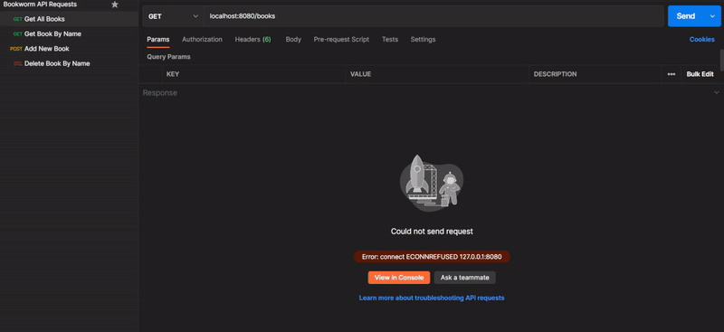

# Bookworm API CRUD Service
Bookworm API is a CRUD service made with [Gin Gonic](https://github.com/gin-gonic/gin), MongoDB, and the [MongoDB Go Driver](https://github.com/mongodb/mongo-go-driver), intended to store and manipulate data on books and organize it in various ways. It's currently in a pre-release state, and is a self-taught learning experience for me. 

 
*Example of using implemented HTTP requests with Postman.*  

 
*Example of data hosted inside a local MongoDB server.*

## Commands
Command | URL | Response | Body Required | Implemented
--- | --- | --- | :---: | :---:
POST | /books | Adds a new book to the active_books collection using a JSON body from the HTTP request. |🟢|🟢
GET | /books | Returns all books in the database. |❌|🟢
GET | /books/:name | Finds and returns a book with the title `:name`. |❌|🟢
DELETE | /books/:name | Finds and deletes a book with the title `:name`. |❌|🟢
PUT | /books | Replaces an existing book object with another book object. |🟢|❌
PATCH | /books | Updates a specific field of an existing book object. |🟢|❌

## Usage
With Go installed, download the project files. Enter the root directory of the project. Run `go mod tidy` if necessary to import required packages. Run `go run .` to start the CRUD service. Currently, the service listens on the local machine, accessible through `localhost:8080`. Use Postman or a web browser to test the current HTTP request commands.

## Database
MongoDB 8.0.3, non-service, run locally.

## Future Plans
CURRENT:
Currently in the process of re-planning this project to be used for games rather than books. This will entail switching nomenclature, switching to a graph database rather than MongoDB, and expanding features to pull games from the Steam API as well as be able to add them locally. I am also planning on adding a REACT front-end that will largely function as an expanded showcase of a user's game ratings on one hand, and a prioritized backlog for wishlisted games on the other.
PREVIOUS:
This CRUD service is meant to eventually become the back-end of a fullstack "Bookworm" application, meant to aid users in organizing what media they plan to interact with, and keep notes and summaries on media they've already consumed. It's a product I plan to personally use and make publicly available.

**Planned & Upcoming Features:**
* Make the server find the URI connection through environment variables of the local machine instead of a hard-coded `localhost` URI.
* Define a standard signature comprised of multiple data fields in a book to be the unique identifier of a book.
* Create detailed search functionality through GET requests to search for keywords in various bookData fields.
* Add PUT and POST functionalities.
* Add book versioning field.
* Add structures to indentify books as part of a series.
* Differentiate between the "wishlist" and "active_books" database collections.
